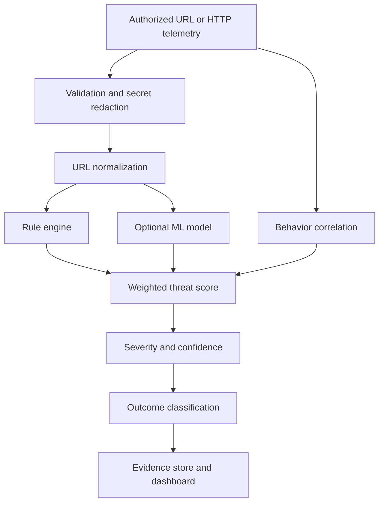

# ByteForce Detection, Machine Learning, and Outcomes

## Detection pipeline



## URL normalization

The normalizer preserves the original value and creates a comparison value by applying HTML decoding, limited repeated percent decoding, Unicode NFKC normalization, safe URL parsing, lowercased comparison fields, and duplicate-preserving query parsing. Malformed values return a parse error instead of crashing.

Common secret query values such as passwords, tokens, API keys, sessions, and OTPs are redacted before persistence.

## Rule engine

Readable signatures are stored in `backend/rules/attack_rules.json`. Python checks add:

- Private, loopback, link-local, reserved, and internal SSRF target detection.
- Conflicting duplicate-parameter detection.
- Protected-domain similarity and punycode review.
- SQL-injection subtype metadata such as `UNION_BASED` and `BLIND_TIME_BASED`.
- XSS subtype metadata such as `DOM_OR_EVENT_HANDLER` and `REFLECTED_OR_STORED`.
- XML external-entity indicators from request bodies.
- Multipart upload indicators for executable server-side filenames.

The rule engine is explainable: every matched rule contributes a readable evidence statement.

## Behavior engine

Events are grouped by source IP. Thresholds detect repeated authentication failures, broad path exploration, repeated 404 responses, scanner activity, and reconnaissance patterns. Brute-force classification requires a batch of requests; one login URL is not enough.

## Machine learning

The optional ML engine uses:

- Character-level TF-IDF features.
- Logistic Regression.
- Multiclass URL labels.
- Versioned Joblib artifacts.
- Accuracy, precision, recall, F1, per-class metrics, and confusion matrix reporting.
- Model activation, rollback, and drift reporting.

The model's score is combined with rules, behavior, and response context. If no model is available, rule and behavior detection continue. The bundled model and demo dataset are synthetic baselines and must not be presented as production accuracy evidence.

Train a reviewed model:

```bash
cd backend
source .venv/bin/activate
python scripts/train_model.py \
  --dataset /absolute/path/to/authorized-reviewed-training.csv \
  --version organization-v1 \
  --no-activate
```

Use at least 100 reviewed records and at least 10 examples per class. Activate a validated version only after reviewing metrics and false positives.

## Outcome model

| Status | Meaning | Required evidence |
|---|---|---|
| `ATTEMPT` | Suspicious input was observed but exploitation is not demonstrated. | Pattern or behavior evidence; rejection and ordinary responses remain attempts. |
| `PROBABLE_SUCCESS` | Suspicious input plus suggestive response context. | Successful response with unusually large body; not proof. |
| `CONFIRMED_SUCCESS` | Corroborated evidence indicates the action succeeded. | Explicit reviewed ground truth, response markers, or supplied follow-up evidence. |
| `BENIGN` | No sufficiently strong suspicious indicators. | No malicious score. |

Supported response evidence includes markers associated with file reads, command output, internal metadata, private keys, password hashes, and shell execution. Operators should provide application logs, WAF logs, response bodies, session context, or subsequent events for trustworthy confirmation.

## Important accuracy boundary

A detected payload is evidence of an attempted or suspicious input, not proof that a vulnerability exists. URL-only analysis cannot reliably identify stored XSS, successful SSRF, command execution, database extraction, session hijacking, or web-shell execution without authorized server-side evidence.
