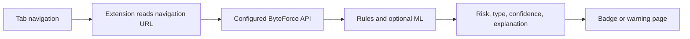

# ByteForce Browser Extension Roadmap

## Status

**Planned future update. Not included in the current release.**

The current ByteForce release has no browser extension and does not monitor a user's browser history. The roadmap is documented so the feature is clearly visible without presenting it as completed functionality.

## Objective

Provide an optional browser client that checks navigation URLs against the existing ByteForce detection API and presents a clear URL-risk status to the user.

## Planned user flow

1. Observe a tab navigation event.
2. Send the URL to a configured ByteForce backend over HTTPS.
3. Display a safe, suspicious, or malicious badge with attack type, confidence, and explanation.
4. Optionally warn before high-risk navigation according to user or organization policy.
5. Cache recent results locally to reduce duplicate requests.

## Planned technical approach

- Manifest V3.
- Chromium-based browsers first, with Chrome and Edge as initial targets.
- Existing `POST /api/detect/url` endpoint as the detection contract.
- Optional organization-managed backend URL.
- Narrow browser permissions.
- User-controlled enable/disable switch.
- Domain allow-list.
- No automatic crawling or page interaction.

## Privacy and security requirements

The extension must not collect or transmit:

- Passwords.
- Cookies or session tokens.
- Form values.
- Page contents.
- Keystrokes.
- More browsing history than is necessary for the current navigation decision.

The backend must use HTTPS in deployed environments. Extension requests should be authenticated where organizational deployments require it, and URL retention should follow the configured data-retention policy.

## Result boundary

A browser extension can identify URL-level risk and suspicious navigation patterns. It cannot reliably prove server-side success, database access, command execution, file reads, session hijacking, or SSRF completion. Those outcomes require authorized response, application, WAF, or follow-up telemetry processed by the main ByteForce platform.

## Planned milestones

| Milestone | Deliverable | Status |
|---|---|---|
| API contract | Stable URL-analysis response for external clients | Current backend available |
| Prototype | Local unpacked Chromium extension with badge and popup | Planned |
| Privacy review | Permission, data-flow, retention, and consent review | Planned |
| Warning policy | Configurable high-risk navigation warning | Planned |
| Organization controls | Managed backend URL, allow-list, and authentication | Planned |
| Cross-browser release | Chrome, Edge, and later Firefox packaging | Planned |

## Acceptance criteria

The future extension should be accepted only when it:

- Uses the same detector and classifications as the dashboard.
- Clearly labels results as URL risk, not proof of compromise.
- Does not send secrets or page contents.
- Handles backend unavailable, timeout, and allow-listed cases safely.
- Provides an explicit privacy notice and disable control.
- Has automated tests for navigation, caching, permissions, API errors, and warning behavior.
